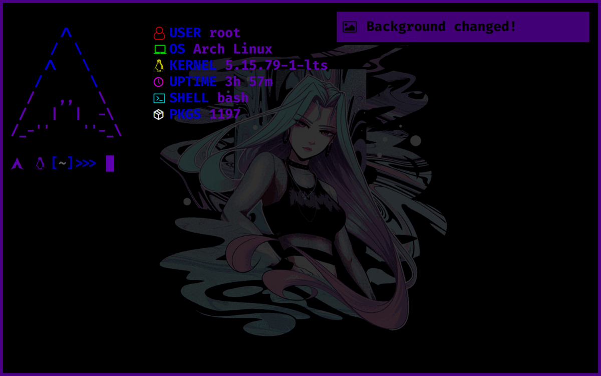

<div align="center">

# `dots`

<h3>
  My dotfiles
</h3>

<!-- Badges -->


<!-- Demo image -->


</div>

<!-- TABLE OF CONTENTS -->
## Table of Contents

* [Project Structure 📁](#project-structure)
* [Usage 🚀](#usage)
* [Develop ⚙️](#develop)
* [License 📑](#license)

## Project Structure 📁
```
dots/
├── config/*   (configuration files)
│   ├── bash
│   ├── mpv
│   ├── nvim
│   └── ...
├── AUTHORS
├── LICENSE
├── README.md
├── TODO.md
├── demo.gif
├── packages
└── setup
```

## Usage 🚀
> This is used on a fresh arch linux install!
- Clone the repo:
```shell
$ git clone https://github.com/nemo256/dots
```
- Run the setup script:
```shell
$ cd dots
$ chmod +x setup
$ ./setup
```

## Develop ⚙️
- Just modify the setup script.

## License 📑
- Please read [dots/LICENSE](https://github.com/nemo256/dots/blob/master/LICENSE)
